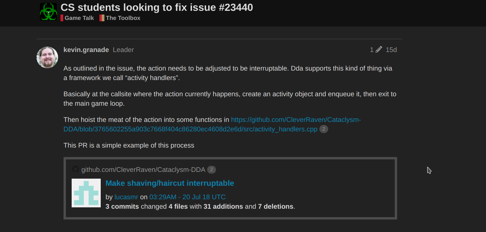
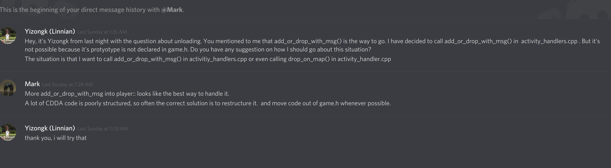
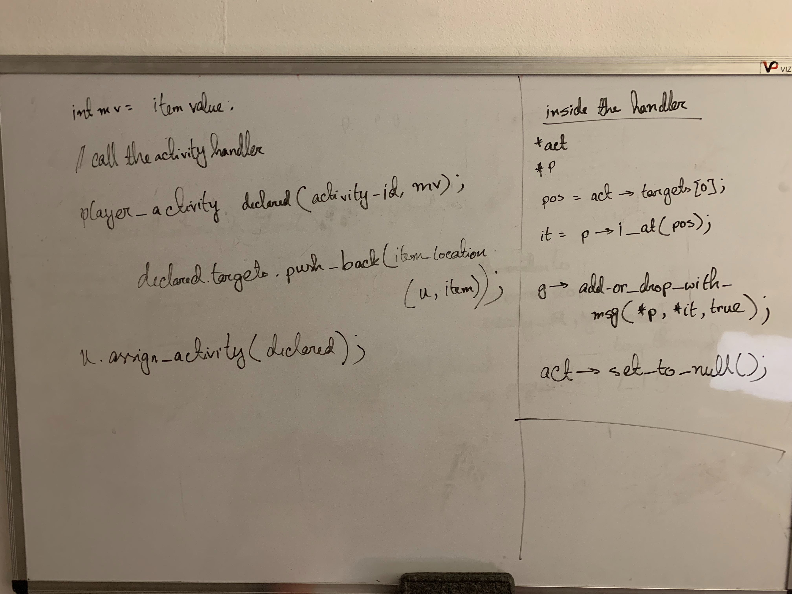

# A [Work in Progress], [Comments Requested] pull request

This last blog post will consist of my thoughts and experiences as my team and I work on attempting to resolve a bug in the project [Cataclysm: Dark Days Ahead](https://cataclysmdda.org/)

We came across a [bug report](https://github.com/CleverRaven/Cataclysm-DDA/issues/23440) detailing an issue with the player's character when attempting to fight an enemy. If the user tries to unload an ammunition belt or magazine cartridge, their action is supposed to be interruptible. Instead they are locked in a state where no command can be issued, thus leaving them open to attacks.

The first issue we encountered was that that code was inconsistently documented. The project is large and complicated, so it took some time to understand where function calls were occurring and how class objects and attributes related to each other. Some of the code has helpful documentation, while in other areas it is lacking. We made attempts to reach out and get some help from the community.

The solution proposed involved using a provided framework, called activity_handlers, that allow defined actions to be interruptible. We would have to move the functions taking care of the *unload action* into an activity_handler, then have the defined activity called in the main game loop.

The problem was that the activity handler framework has parameters that doesn't take in an 'item' object, but a 'player' object. But 'player' objects don't have 'item' data members. Teammate yizongk managed to get a suggestion from a member of the development community.

The best way of handling the code was to restructure and to move some functions to the *player* class, as this would allow the user to call the activity handler to interrupt the unloading.

Teammate f0cus10 then made a rough sketch for how we should write our code

The code on the left is what executes in the main game loop, the code on the right defines the activity we want to be interruptible, the unloading of ammunition.

Both yizongk and f0cus10 contributed [the code for the activity handler and shifting code to the player class](https://github.com/CleverRaven/Cataclysm-DDA/pull/27177/files). The code successfully compiled.

As yizongk and I tested our fix, we confirmed that the unloading of ammunition was interruptible. The only problem was that when attempting to unload ammunition without the presence of enemies, the game would crash. Further attempts to fix the issue stops the game from crashing when unloading with no enemies present, but would instead crash when attempting to access the inventory menu.

We came to the conclusion that the best course would be to get our code reviewed by the community. I issued a [pull request](https://github.com/CleverRaven/Cataclysm-DDA/pull/27177) making note of what we did and the problems we were facing.

The largest issue was the lack of documentation. It took a while for me to understand how the activity handler, the player class and the game class interacted with each other to execute the unloading command. It would have been easier to follow with proper documentation.

Even if there was some difficulty, and at the end our contribution was not ready by the end of the semester, this was a very valuable experience. Coordinating with a team is a skill that will be very important any future career. What I also find valuable was getting a chance to work on real world code. Instead of solving small puzzles without much context, I got a chance to look at and work with code that people use for leisure.